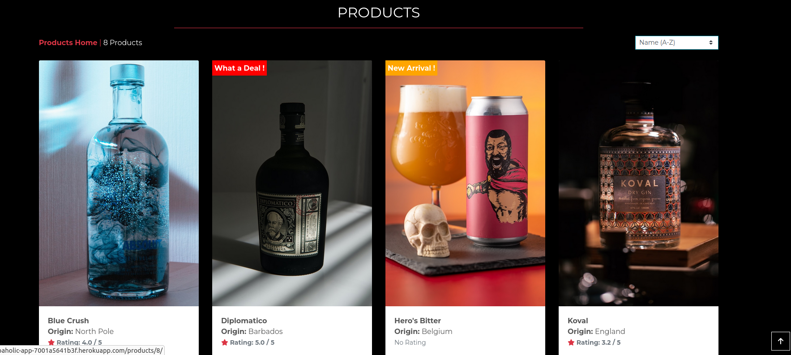
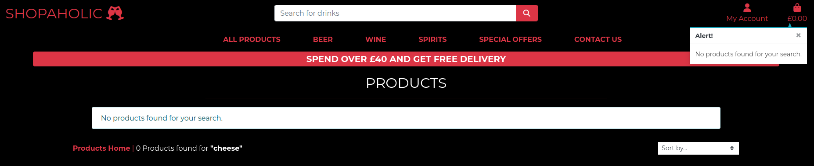

# SHOPPING APP

This is a shopping app for a selection of alcoholic beverages. It will have a fully functioning checkout system and allow users to log in to their accounts. It utilises django, python, stripe (as the payment system) and amazon web services (AWS) to host media files. The app contains 4 custom models that have been built to facilitate the needs of the application. The superuser can add and remove items and their descriptions, as well as utilise the admin from the front end or the django admin center. Orders can be viewed here with CRUD functionality. The user can search and sort products and the admin user can also set special offers on any product they like.

https://ui.dev/amiresponsive?url=https://shopaholic-app-7001a5641b3f.herokuapp.com/


## UX

The general UX theme was taken from the Code Institutes boutique Ado tutorial as having this to assist me as a base template would allow me to learn how to navigate a django app and its intricacies quicker.


### Colour Scheme

I wanted the colours to pop and be complient for accessibility. White text on a black background was an obvious choice 


### Typography

- [Montserrat](https://fonts.google.com/specimen/Montserrat) was used for the primary headers and titles.

- [Font Awesome](https://fontawesome.com) icons were used throughout the site


## User Stories

### New Site Users

- As a new site user, I would like to be able to add/delete alcoholic drinks to my basket, so that I can checkout with the correct basket.
- As a new site user, I would like to search all products, a product type or special offers, so that I can narrow down my choices.
- As a new site user, I would like to be able to sort my results , so that I can sort by A-Z, Z-A, rating, type etc .
- As a new site user, I would like to see new arrivals, clearence and deals, so that I can make an informed choice on my purchases.
- As a new site user, I would like to be able to create an account, so that I can login, logout and see my purchases.
- As a new site user, I would like to be able to pay by credit or debit card in the app, so that I can quickly make a purchase.
- As a new site user, I would like to be able to see what goes into my basket via a notification so that I can see what I am purchasing.
- As a new site user, I would like to be able to see a confirmation of what I have purchased once I have checked out so I can see what I have purchased.
- As a new site user, I would like to be able to contact the company via a contact form should I have any issues, so I can get help if required.
- As a new site user, I would like to be able to sign up to a email newsletter, so that I can keep up to date with news and offers.
- As a new site user, I would like to be able to see a rating for each item, so I get to know how good it is.

### Returning Site Users

- As a returning site user, I would like to see my past purchases, so that I can make the same purchase.
- As a returning site user, I would like to be able to log in to my account, so that I can make a purchase.
- As a returning site user, I would like to see what new offers are available, so that I can consider a purchase.


### Site Admin

- As a site administrator, I should be able to log in and log out as a superuser, so that I can make admin changes that normal users cannot.
- As a site administrator, I should be able to edit/delete products on the front end, so that I can adjust prices/details etc etc.
- As a site administrator, I should be able to view all customer orders, so that I can manage order processing and fullfillment.
- As a site administrator, I should be able to see that payments have been processed with a time and date, so that I can ensure they are delivered.
- As a site administrator, I should be able to manage user accounts and passwords, so that I can remove/add or change accounts or passwords.
- As a site administrator, I should be able to see who has filled in a form, so that I can respond accordingly and edit or delete/add customer details.
- As a site administrator, I should be able to see who has filled in a form, so that I can respond to them accordingly.
- As a site administrator I should be able tosee who has filled in a subscribe email and edit/delete them


## Wireframes

I've used [Figma](https://figma.com) to design my site wireframes. As the product page template is used for filtering products via their tpe when the main nav menu is clicked, for eample wines, red wine, I have not shown wireframes for the navbar pages as they would be exactly the same as the products page. This is with the exception of the Contact Us page which has a form for the user to fill in.

### Home Page Wireframes


### Product Page Wireframes


### Contact Page Wireframes


### Bag Page Wireframes


### Payment Confirmation Page Wireframes


### Thank You/Subscription Confirmation Page Wireframes


## Features


### Existing Features

- **Subscribe to Email Newsletter**

    - This feature allows the user to signup to an email newsletter. They get a confirmation email to their email address once subscribed for confirmation of the signup. Admin can see who has subscribed in the admin dashboard.


- **Contact Form**

    - The contact form allows a user to make an enquiry to Shopaholic. The user lands on a confirmation page when they submit the form and the admin gets the details from the form in the dashboard admin under contact/messages.


- **Spend Over £40 Get Free Delivery**

    - If a user spends over £40 they get free devivery and this is calculated at checkout and the delivery cost removed automatically. When a user places items in their basket that are under £40 then a toast notification appears and shows how much more they need to spend to get the free delivery.


- **Sort By Feature**

    - The user can sort the products by using the sort dropdown menu by price, type, name and rating and choosing to sort by high or low values. The screenshot shows sorting by Name A-Z.




- **Edit Delete Add Frontend Feature For Admin**

    - Admin can edit or delete products from the front end when they are logged in by simply looking at a product and clicking either Edit or Delete. Clicking Edit gives admin full CRUD functionality for all of the values associated with a product.


- **Toasts For Notifications**

    - There are various toasts for the user which are displayed when the user undertakes a specific action which triggers an event listener and the toast appears on the screen.





- **Search Functionality**

    - The user can use the search input to search for any product that they may be looking for. If a user enters characters that dont match a product then they are greeted with a toast and a page that says no products match  your search as seen in the toasts images above.


- **Edit Delete Add Frontend Feature For Admin**

    - Admin can edit or delete products from the front end when they are logged in by simply looking at a product and clicking either Edit or Delete. Clicking Edit gives admin full CRUD functionality for all of the values associated with a product.


- **Automated Confirmation of User Order**

    - The User is redirected to a confirmation page after placing an order on the frontend. Admin also sees this order in the backend.


- **Admin Can Add Deal, New Product and Clearence To Any Product**

    - The admin has the ability to add tag to any product which is displayed on the front end to show the user that a product is in a deal, clearence or a new product. These products with these tags added are now searchable in the top menu under special offers where they can be searched for by type. These can be turned on and off in the Admin dashboard by selecting a product or a group of products.


 **Log in / Log out features**

- Both the superuser and the user can log in and log out and under no circumstances can anyone except for the superuser in the backend access anyone elses account or see anyone elses data.


### Future Features


- Giving the user the option to rate products
    - Allow users to leave reviews and ratings for products they have purchased, enhancing the shopping experience for others.
- Personalized Recommendations
    - Implement a system that suggests products based on the user’s browsing history and previous purchases.
- Subscription Services
    - Offer a subscription model where users can receive their favorite beverages regularly without needing to reorder.
- Gift Cards and Vouchers
    - Introduce gift card purchasing options for users who want to gift store credit to others.
- Interactive Chatbot
    - Deploy a chatbot to help customers with FAQs, track orders, and provide recommendations.
- Mobile App
    - Develop a mobile application to enhance accessibility and provide push notifications for deals and order updates.
- Loyalty Program
    - Create a loyalty program offering points or discounts to frequent shoppers, encouraging repeat business.
- Social Media Integration
    - Allow users to connect their social media accounts for easy sharing of products and promotions.
- Augmented Reality 
    - Implement AR to let users visualize how certain products, like wine or spirit bottles, would look in their home.
- Multi-Currency Support
    - Add functionality to show prices and process transactions in different currencies based on the user’s location.
- A Footer & Address Information
    - A footer would be nice which could contain the details of the company such as address, social icons etc etc
- Sales History
	- Have the app save a customers product sales history on their account
- Email Confirmation For Purchase
	- Have the app send an email to the customer on completion of an order
- Stock Updates
	- Ammend stock as product is sold

## Tools & Technologies Used


- [HTML](https://en.wikipedia.org/wiki/HTML) used for the main site content.
- [CSS](https://en.wikipedia.org/wiki/CSS) used for the main site design and layout.
- [JavaScript](https://www.javascript.com) used for user interaction on the site.
- [Python](https://www.python.org) used as the back-end programming language.
- [GitHub](https://github.com) used for secure online code storage.
- [Gitpod](https://gitpod.io) used as a cloud-based IDE for development.
- [Bootstrap](https://getbootstrap.com) used as the front-end CSS framework for modern responsiveness and pre-built components.
- [Django](https://www.djangoproject.com) used as the Python framework for the site.
- [ElephantSQL](https://www.elephantsql.com) used as the Postgres database.
- [Heroku](https://www.heroku.com) used for hosting the deployed back-end site.
- [Stripe](https://stripe.com) used for online secure payments of ecommerce products/services.
- [AWS S3](https://aws.amazon.com/s3) used for online static file storage.
- [Mermaidchart](https://mermaidchart.com) used making the ERD diagram.

## Database Design


The ERD diagram shows all of the relationships of the tables to include primary and foreign keys for the entire database. It shows the one to many and one to one relationships. Cardinality is also shown for the relationships that are optional. 

TO NOTE: As the ERD was made prior to developing there are minor changes when comparing the choice of entity names and type, but these can be seen in the example python code and table and are the entities actually used in the application.


### PRODUCT MODEL USED AS AN EXAMPLE ###

```python
class Product(models.Model):
    category = models.ForeignKey('Category', null=True, blank=True, on_delete=models.SET_NULL)
    alcohol_type = models.ForeignKey('AlcoholType', null=True, blank=True, on_delete=models.SET_NULL)
    sku = models.CharField(max_length=254, null=True, blank=True)
    name = models.CharField(max_length=254)
    description = models.TextField(max_length=200)
    price = models.DecimalField(max_digits=6, decimal_places=2)
    new_arrival = models.BooleanField(default=False, help_text="Check this if the product is a new arrival.")
    deal = models.BooleanField(default=False, help_text="Check this if the product is on deal.")
    clearance = models.BooleanField(default=False, help_text="Check this if the product is on clearance.")
    rating = models.DecimalField(max_digits=6, decimal_places=1, null=True, blank=True)
    alcohol_content = models.DecimalField(max_digits=4, decimal_places=1, help_text="Alcohol content in percentage")
    volume = models.DecimalField(max_digits=5, decimal_places=0, help_text="Volume in ml")
    country_of_origin = models.CharField(max_length=100)
    year_of_production = models.PositiveIntegerField(null=True, blank=True)
    taste_notes = models.TextField(max_length=200, null=True, blank=True)
    stock = models.PositiveIntegerField(default=0)
    image_url = models.URLField(max_length=1024, null=True, blank=True)
    image = models.ImageField(null=True, blank=True)


    def __str__(self):
        return self.name
```


- Table: **Product As An Example**

    | **PK** | **ID** (unique) | **Type** | **Notes** |
    |--------|-----------------|----------|-----------|
    |        | category        | ForeignKey | models.ForeignKey('Category', on_delete=models.SET_NULL, null=True, blank=True) |
    |        | alcohol_type    | ForeignKey | models.ForeignKey('AlcoholType', on_delete=models.SET_NULL, null=True, blank=True) |
    |        | sku             | CharField | max_length=254, null=True, blank=True |
    |        | name            | CharField | max_length=254 |
    |        | description     | TextField | max_length=200 |
    |        | price           | DecimalField | max_digits=6, decimal_places=2 |
    |        | new_arrival     | BooleanField | default=False, help_text="Check this if the product is a new arrival." |
    |        | deal            | BooleanField | default=False, help_text="Check this if the product is on deal." |
    |        | clearance       | BooleanField | default=False, help_text="Check this if the product is on clearance." |
    |        | rating          | DecimalField | max_digits=6, decimal_places=1, null=True, blank=True |
    |        | alcohol_content | DecimalField | max_digits=4, decimal_places=1, help_text="Alcohol content in percentage" |
    |        | volume          | DecimalField | max_digits=5, decimal_places=0, help_text="Volume in ml" |
    |        | country_of_origin | CharField | max_length=100 |
    |        | year_of_production | PositiveIntegerField | null=True, blank=True |
    |        | taste_notes     | TextField | max_length=200, null=True, blank=True |
    |        | stock           | PositiveIntegerField | default=0 |
    |        | image_url       | URLField | max_length=1024, null=True, blank=True |
    |        | image           | ImageField | null=True, blank=True |


## Testing

For all testing, please refer to the [TESTING.md](TESTING.md) file.

## Deployment


The live deployed application can be found deployed on [Heroku](https://shopaholic-app-7001a5641b3f.herokuapp.com/).

### ElephantSQL Database

This project uses [ElephantSQL](https://www.elephantsql.com) for the PostgreSQL Database.

To obtain your own Postgres Database, sign-up with your GitHub account, then follow these steps:
- Click **Create New Instance** to start a new database.
- Provide a name (this is commonly the name of the project: Shopping-app).
- Select the **Tiny Turtle (Free)** plan.
- You can leave the **Tags** blank.
- Select the **Region** and **Data Center** closest to you.
- Once created, click on the new database name, where you can view the database URL and Password.

### Amazon AWS

This project uses [AWS](https://aws.amazon.com) to store media and static files online, due to the fact that Heroku doesn't persist this type of data.

Once you've created an AWS account and logged-in, follow these series of steps to get your project connected.
Make sure you're on the **AWS Management Console** page.

#### S3 Bucket

- Search for **S3**.
- Create a new bucket, give it a name (matching your Heroku app name), and choose the region closest to you.
- Uncheck **Block all public access**, and acknowledge that the bucket will be public (required for it to work on Heroku).
- From **Object Ownership**, make sure to have **ACLs enabled**, and **Bucket owner preferred** selected.
- From the **Properties** tab, turn on static website hosting, and type `index.html` and `error.html` in their respective fields, then click **Save**.
- From the **Permissions** tab, paste in the following CORS configuration:

	```shell
	[
		{
			"AllowedHeaders": [
				"Authorization"
			],
			"AllowedMethods": [
				"GET"
			],
			"AllowedOrigins": [
				"*"
			],
			"ExposeHeaders": []
		}
	]
	```

- Copy your **ARN** string.
- From the **Bucket Policy** tab, select the **Policy Generator** link, and use the following steps:
	- Policy Type: **S3 Bucket Policy**
	- Effect: **Allow**
	- Principal: `*`
	- Actions: **GetObject**
	- Amazon Resource Name (ARN): **paste-your-ARN-here**
	- Click **Add Statement**
	- Click **Generate Policy**
	- Copy the entire Policy, and paste it into the **Bucket Policy Editor**

		```shell
		{
			"Id": "Policy1234567890",
			"Version": "2012-10-17",
			"Statement": [
				{
					"Sid": "Stmt1234567890",
					"Action": [
						"s3:GetObject"
					],
					"Effect": "Allow",
					"Resource": "arn:aws:s3:::your-bucket-name/*"
					"Principal": "*",
				}
			]
		}
		```

	- Before you click "Save", add `/*` to the end of the Resource key in the Bucket Policy Editor (like above).
	- Click **Save**.
- From the **Access Control List (ACL)** section, click "Edit" and enable **List** for **Everyone (public access)**, and accept the warning box.
	- If the edit button is disabled, you need to change the **Object Ownership** section above to **ACLs enabled** (mentioned above).

#### IAM

Back on the AWS Services Menu, search for and open **IAM** (Identity and Access Management).
Once on the IAM page, follow these steps:

- From **User Groups**, click **Create New Group**.
	- Suggested Name: `group-shopping-app` (group + the project name)
- Tags are optional, but you must click it to get to the **review policy** page.
- From **User Groups**, select your newly created group, and go to the **Permissions** tab.
- Open the **Add Permissions** dropdown, and click **Attach Policies**.
- Select the policy, then click **Add Permissions** at the bottom when finished.
- From the **JSON** tab, select the **Import Managed Policy** link.
	- Search for **S3**, select the `AmazonS3FullAccess` policy, and then **Import**.
	- You'll need your ARN from the S3 Bucket copied again, which is pasted into "Resources" key on the Policy.

		```shell
		{
			"Version": "2012-10-17",
			"Statement": [
				{
					"Effect": "Allow",
					"Action": "s3:*",
					"Resource": [
						"arn:aws:s3:::your-bucket-name",
						"arn:aws:s3:::your-bucket-name/*"
					]
				}
			]
		}
		```
	
	- Click **Review Policy**.
	- Suggested Name: `policy-shopping-app` (policy + the project name)
	- Provide a description:
		- "Access to S3 Bucket for shopping-app static files."
	- Click **Create Policy**.
- From **User Groups**, click your "group-shopping-app".
- Click **Attach Policy**.
- Search for the policy you've just created ("policy-shopping-app") and select it, then **Attach Policy**.
- From **User Groups**, click **Add User**.
	- Suggested Name: `user-shopping-app` (user + the project name)
- For "Select AWS Access Type", select **Programmatic Access**.
- Select the group to add your new user to: `group-shopping-app`
- Tags are optional, but you must click it to get to the **review user** page.
- Click **Create User** once done.
- You should see a button to **Download .csv**, so click it to save a copy on your system.
	- **IMPORTANT**: once you pass this page, you cannot come back to download it again, so do it immediately!
	- This contains the user's **Access key ID** and **Secret access key**.
	- `AWS_ACCESS_KEY_ID` = **Access key ID**
	- `AWS_SECRET_ACCESS_KEY` = **Secret access key**

#### Final AWS Setup

- If Heroku Config Vars has `DISABLE_COLLECTSTATIC` still, this can be removed now, so that AWS will handle the static files.
- Back within **S3**, create a new folder called: `media`.
- Select any existing media images for your project to prepare them for being uploaded into the new folder.
- Under **Manage Public Permissions**, select **Grant public read access to this object(s)**.
- No further settings are required, so click **Upload**.

### Stripe API

This project uses [Stripe](https://stripe.com) to handle the ecommerce payments.

Once you've created a Stripe account and logged-in, follow these series of steps to get your project connected.

- From your Stripe dashboard, click to expand the "Get your test API keys".
- You'll have two keys here:
	- `STRIPE_PUBLIC_KEY` = Publishable Key (starts with **pk**)
	- `STRIPE_SECRET_KEY` = Secret Key (starts with **sk**)

As a backup, in case users prematurely close the purchase-order page during payment, we can include Stripe Webhooks.

- From your Stripe dashboard, click **Developers**, and select **Webhooks**.
- From there, click **Add Endpoint**.
	- `https://shopaholic-33f79d336a28.herokuapp.com/checkout/wh/`
- Click **receive all events**.
- Click **Add Endpoint** to complete the process.
- You'll have a new key here:
	- `STRIPE_WH_SECRET` = Signing Secret (Wehbook) Key (starts with **wh**)

### Gmail API

This project uses [Gmail](https://mail.google.com) to handle sending emails to users for account verification and purchase order confirmations.

Once you've created a Gmail (Google) account and logged-in, follow these series of steps to get your project connected.

- Click on the **Account Settings** (cog icon) in the top-right corner of Gmail.
- Click on the **Accounts and Import** tab.
- Within the section called "Change account settings", click on the link for **Other Google Account settings**.
- From this new page, select **Security** on the left.
- Select **2-Step Verification** to turn it on. (verify your password and account)
- Once verified, select **Turn On** for 2FA.
- Navigate back to the **Security** page, and you'll see a new option called **App passwords**.
- This might prompt you once again to confirm your password and account.
- Select **Mail** for the app type.
- Select **Other (Custom name)** for the device type.
	- Any custom name, such as "Django" or Shopping-app
- You'll be provided with a 16-character password (API key).
	- Save this somewhere locally, as you cannot access this key again later!
	- `EMAIL_HOST_PASS` = user's 16-character API key
	- `EMAIL_HOST_USER` = user's own personal Gmail email address

### Heroku Deployment

This project uses [Heroku](https://www.heroku.com), a platform as a service (PaaS) that enables developers to build, run, and operate applications entirely in the cloud.

Deployment steps are as follows, after account setup:

- Select **New** in the top-right corner of your Heroku Dashboard, and select **Create new app** from the dropdown menu.
- Your app name must be unique, and then choose a region closest to you (EU or USA), and finally, select **Create App**.
- From the new app **Settings**, click **Reveal Config Vars**, and set your environment variables.

| Key | Value |
| --- | --- |
| `AWS_ACCESS_KEY_ID` | user's own value |
| `AWS_SECRET_ACCESS_KEY` | user's own value |
| `DATABASE_URL` | user's own value |
| `DISABLE_COLLECTSTATIC` | 1 (*this is temporary, and can be removed for the final deployment*) |
| `EMAIL_HOST_PASS` | user's own value |
| `EMAIL_HOST_USER` | user's own value |
| `SECRET_KEY` | user's own value |
| `STRIPE_PUBLIC_KEY` | user's own value |
| `STRIPE_SECRET_KEY` | user's own value |
| `STRIPE_WH_SECRET` | user's own value |
| `USE_AWS` | True |

Heroku needs two additional files in order to deploy properly.
- requirements.txt
- Procfile

You can install this project's **requirements** (where applicable) using:
- `pip3 install -r requirements.txt`

If you have your own packages that have been installed, then the requirements file needs updated using:
- `pip3 freeze --local > requirements.txt`

The **Procfile** can be created with the following command:
- `echo web: gunicorn app_name.wsgi > Procfile`
- *replace **app_name** with the name of your primary Django app name; the folder where settings.py is located*

For Heroku deployment, follow these steps to connect your own GitHub repository to the newly created app:

Either:
- Select **Automatic Deployment** from the Heroku app.

Or:
- In the Terminal/CLI, connect to Heroku using this command: `heroku login -i`
- Set the remote for Heroku: `heroku git:remote -a app_name` (replace *app_name* with your app name)
- After performing the standard Git `add`, `commit`, and `push` to GitHub, you can now type:
	- `git push heroku main`

The project should now be connected and deployed to Heroku!

### Local Deployment

This project can be cloned or forked in order to make a local copy on your own system.

For either method, you will need to install any applicable packages found within the *requirements.txt* file.
- `pip3 install -r requirements.txt`.

You will need to create a new file called `env.py` at the root-level,
and include the same environment variables listed above from the Heroku deployment steps.

Sample `env.py` file:

```python
import os

os.environ.setdefault("AWS_ACCESS_KEY_ID", "user's own value")
os.environ.setdefault("AWS_SECRET_ACCESS_KEY", "user's own value")
os.environ.setdefault("DATABASE_URL", "user's own value")
os.environ.setdefault("EMAIL_HOST_PASS", "user's own value")
os.environ.setdefault("EMAIL_HOST_USER", "user's own value")
os.environ.setdefault("SECRET_KEY", "user's own value")
os.environ.setdefault("STRIPE_PUBLIC_KEY", "user's own value")
os.environ.setdefault("STRIPE_SECRET_KEY", "user's own value")
os.environ.setdefault("STRIPE_WH_SECRET", "user's own value")

## local environment only (do not include these in production/deployment!)
os.environ.setdefault("DEBUG", "True")
```

Once the project is cloned or forked, in order to run it locally, you'll need to follow these steps:
- Start the Django app: `python3 manage.py runserver`
- Stop the app once it's loaded: `CTRL+C` or `⌘+C` (Mac)
- Make any necessary migrations: `python3 manage.py makemigrations`
- Migrate the data to the database: `python3 manage.py migrate`
- Create a superuser: `python3 manage.py createsuperuser`
- Load fixtures (if applicable): `python3 manage.py loaddata file-name.json` (repeat for each file)
- Everything should be ready now, so run the Django app again: `python3 manage.py runserver`

If you'd like to backup your database models, use the following command for each model you'd like to create a fixture for:
- `python3 manage.py dumpdata your-model > your-model.json`
- *repeat this action for each model you wish to backup*

#### Cloning

You can clone the repository by following these steps:

1. Go to the [GitHub repository](https://github.com/MJstephenson/Shopping-app) 
2. Locate the Code button above the list of files and click it 
3. Select if you prefer to clone using HTTPS, SSH, or GitHub CLI and click the copy button to copy the URL to your clipboard
4. Open Git Bash or Terminal
5. Change the current working directory to the one where you want the cloned directory
6. In your IDE Terminal, type the following command to clone my repository:
	- `git clone https://github.com/MJstephenson/Shopping-app.git`
7. Press Enter to create your local clone.

Alternatively, if using Gitpod, you can click below to create your own workspace using this repository.

[](https://gitpod.io/#https://github.com/MJstephenson/Shopping-app)

Please note that in order to directly open the project in Gitpod, you need to have the browser extension installed.
A tutorial on how to do that can be found [here](https://www.gitpod.io/docs/configure/user-settings/browser-extension).

#### Forking

By forking the GitHub Repository, we make a copy of the original repository on our GitHub account to view and/or make changes without affecting the original owner's repository.
You can fork this repository by using the following steps:

1. Log in to GitHub and locate the [GitHub Repository](https://github.com/MJstephenson/Shopping-app)
2. At the top of the Repository (not top of page) just above the "Settings" Button on the menu, locate the "Fork" Button.
3. Once clicked, you should now have a copy of the original repository in your own GitHub account!

### Local VS Deployment

- The local version of the app works exactly the same as the production version except for a few instances:
  - The database is different so the same products will not appear in each instance
  - The emails will not physically be sent in the local environment, but therminal can be viewed to check whether an email has been sent as the email text should appear when a user subscribes to the newsletter.

## Credits


### Content

I based this application on the Code Institutes tutorial for Boutique Ado and made it my own by adding custom models, images, colours and extra pages. So credit needs to go to the creators of the tutorial including [Chris Z](https://github.com/ckz8780). The repository for the code can be found here [Boutique_ado_v1](https://github.com/ckz8780/boutique_ado_v1)


### Media


| Source | Location | Type | Notes |
| --- | --- | --- | --- |
| [Unsplash](https://unsplash.com/photos/V1zGiNVPumM) | homepage | image | hero background image |
| [Unsplash](https://unsplash.com/photos/fAz5Cf1ajPM) | products | image | sauvignon white wine |
| [Unsplash](https://unsplash.com/photos/pXyNqLpNqAU) | products | image | rose wine |
| [Unsplash](https://unsplash.com/photos/zIo9Fbh8qJc) | products | image | red wine |
| [Unsplash](https://unsplash.com/photos/V1zGiNVPumM) | products | image | Marks rum |
| [Unsplash](https://unsplash.com/photos/ybxexK6umlM) | products | image | hero bitter |
| [Unsplash](https://unsplash.com/photos/OzMHgwxTolo) | products | image | koval gin |
| [Unsplash](https://unsplash.com/photos/296kqnmcgUQ) | products | image | blue crush vodka |


### Acknowledgements


- I would like to thank my Code Institute mentor, [Tim Nelson](https://github.com/TravelTimN) for their support throughout the latter end of development of this project to get it past the post.

- I would like to thank my wife for looking after our baby and boy evenings and weekends to give me time to put this project together. Especially for supporting me with the pain and fatigue caused by Crohn's Disease which has made planning and producing this project so difficult. 

- Definately my two boys that dont understand that dad cant play or go out with them as he needs to finish this. Time that I will never get back which sucks. Thanks for sucking it up.
